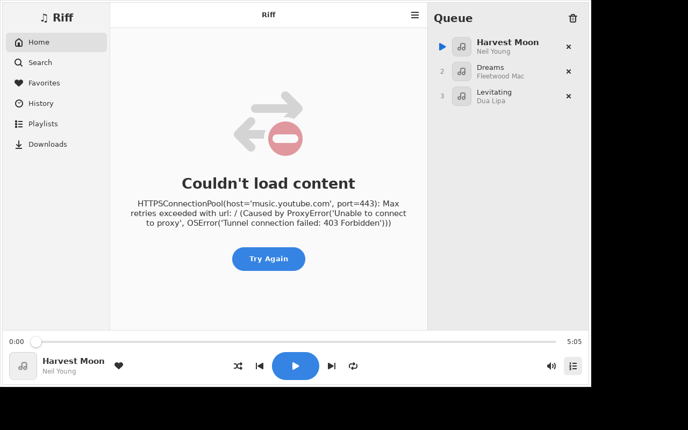

# Riff 🎵

A **native Linux music player** that streams from YouTube Music — no ads, no
account, no browser. Inspired by [RiPlay](https://github.com/fast4x/RiPlay)
and [Harmony Music](https://github.com/anandnet/Harmony-Music), built for
**CachyOS** (and any other Arch-based or modern Linux distro) with
**GTK4 + libadwaita**, so it looks and feels at home on the Linux desktop.



## Features

- 🔍 **Search** songs, albums, artists and playlists on YouTube Music
- 🏠 **Home feed** with charts, moods and personalized-style recommendations
- 📻 **Radio / autoplay** — when your queue runs out, related songs keep playing
- 🗒️ **Full queue control** — play next, add to queue, reorder-by-jump, shuffle,
  repeat (off / all / one)
- ❤️ **Favorites, history and local playlists**, stored in a local SQLite database
- ⬇️ **Offline downloads** (best-audio via yt-dlp); downloaded songs play from disk
- 🎤 **Lyrics** for the current song
- 🎧 **Gapless-ready mpv audio engine** with stream prefetching for instant
  track changes
- 🖥️ **MPRIS integration** — media keys, GNOME/KDE media widgets and
  `playerctl` all work
- 🚫 No ads, no tracking, no Google account required

## Install on CachyOS / Arch

### Option A — pacman package (recommended)

```bash
# python-ytmusicapi is in the AUR; CachyOS ships paru out of the box
paru -S python-ytmusicapi

git clone https://github.com/aimdi/player.git
cd player/packaging
makepkg -si
```

### Option B — install script (no makepkg)

```bash
git clone https://github.com/aimdi/player.git
cd player
./install.sh
```

The script installs the system dependencies with pacman, sets up an isolated
virtualenv in `~/.local/share/riff-venv`, and adds a launcher plus a desktop
entry. Uninstall with:

```bash
rm -rf ~/.local/share/riff-venv ~/.local/bin/riff \
       ~/.local/share/applications/io.github.aimdi.Riff.desktop
```

### Run from source (any distro)

```bash
# Dependencies: GTK4, libadwaita, PyGObject, libmpv, plus two Python libs
sudo pacman -S python-gobject gtk4 libadwaita mpv yt-dlp   # CachyOS/Arch
pip install --user ytmusicapi yt-dlp

git clone https://github.com/aimdi/player.git
cd player
python -m riff
```

## Usage

| Action | How |
|---|---|
| Play a song + similar songs | Click any song (starts YT Music radio) |
| Play an album/playlist in order | Open it, press **Play** |
| Queue management | Song menu → *Play Next* / *Add to Queue*, or the queue button (bottom right) |
| Favorites / playlists / downloads | Song menu (⋮) on any track |
| Lyrics | Header menu → *Lyrics* |
| Shortcuts | `Space` play/pause · `Ctrl+←/→` prev/next · `Ctrl+F` search · `Ctrl+Q` quit |

Settings (audio quality, download folder, radio autoplay) live in
`~/.config/riff/settings.json`; the library database in
`~/.local/share/riff/library.db`; downloads default to `~/Music/Riff`.

## Architecture

```
riff/
├── app.py            Adw.Application, global shortcuts
├── mpris.py          MPRIS2 D-Bus server (media keys, playerctl)
├── config.py         XDG paths + JSON settings
├── core/             UI-independent — fully unit-tested
│   ├── api.py        ytmusicapi wrapper → typed models
│   ├── models.py     Track / Album / Artist / Playlist dataclasses
│   ├── stream.py     yt-dlp stream-URL resolver with TTL cache
│   ├── player.py     libmpv audio engine (ctypes, no extra deps)
│   ├── queue.py      shuffle / repeat / play-order logic
│   ├── service.py    PlaybackService: queue + engine + radio autoplay
│   ├── library.py    SQLite favorites / history / playlists / downloads
│   └── downloader.py offline downloads
└── ui/               GTK4 + libadwaita widgets and pages
```

Playback pipeline: `ytmusicapi` finds the music → `yt-dlp` resolves a direct
audio stream URL (cached, prefetched for the next track) → `libmpv` plays it.

## Development

```bash
python -m pytest tests/          # unit + libmpv integration tests
python -m riff                   # run the app
```

## License

[GPL-3.0-or-later](LICENSE). Riff is an independent open-source project, not
affiliated with or endorsed by Google/YouTube. It uses publicly available
APIs via [ytmusicapi](https://github.com/sigma67/ytmusicapi) and
[yt-dlp](https://github.com/yt-dlp/yt-dlp); use it in accordance with the
laws and terms applicable to you.
